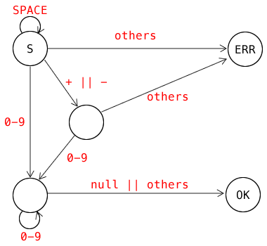

## 8. 字符串转整数(实现atoi函数) [leetcode 8: String to Integer (atoi)]

### 原题链接

[https://leetcode.com/problems/string-to-integer-atoi](https://leetcode.com/problems/string-to-integer-atoi)


### 老王的解法链接
[https://github.com/simplemain/leetcode/blob/master/8/analysis.md](https://github.com/simplemain/leetcode/blob/master/8/analysis.md)

### 难度

★★★☆☆

### 标签

状态机 / 数字计算 / 编译原理

### 题目描述

实现一个字符串转整型的`atoi`函数. 要求如下:

* 去掉`前导空白符`, 直到遇到一个非空白符;
* 接下来, 可能是一个`+`或者`-`;
* 紧接着, 是一堆`数字`;
* 后面可能还有一堆`非数字的字符`, 这些东西可以忽略;

如果以下情况, 请返回`0`:

* 前导的`非空白符`不是数字;
* 或者, 是`空串`
* 或者, 是`空白符串`

注意: 

* 空白符只有空格`' '`
* 假定, 我们的系统只能处理32位有符号整数, 如果超过[−2<sup>31</sup>,  2<sup>31</sup> − 1]这个范围, 就返回INT_MAX (2<sup>31</sup> − 1) 或 INT_MIN (−2<sup>31</sup>)


### 输入样例

```
第一组: "42"
第二组: "   -42"
第三组: "4193 with words"
第四组: "words and 987"
第五组: "-91283472332"
```

### 输出样例

```
第一组: 42
第二组: -42
第三组: 4193
第四组: 0
第五组: -2147483648
```

### 解法分析

---

* 解法1 : 状态机

这个题拿到的第一感觉就是: 题!好!长!

题目说了n多要求, 实际上简化一下就是: 把一个有前导空格的字符串的前面整数部分提取出来.

这种题目最直接的做法, 就是利用状态机进行字符提取.

我们可以画出以下状态机:



只要状态机画出来了, 对应代码就很好写了.

这里另外有一个点, 就是32位整数的问题. 这个题在之前的[第7题](https://github.com/simplemain/leetcode/blob/master/7/analysis.md)已经处理过了, 老王就不再单独说明了.

完整代码请点击这里: [完整代码](https://github.com/simplemain/leetcode/blob/master/8/Solution1.java)

---

### 扩展知识

其实这个题可以看成`编译原理`里面最简单的`词法分析`. 里面就用到了`状态机`. 大家有兴趣的话, 可以再去读读编译原理的书.

---

好了, 这一题就分析到这里. 如果觉得老王的讲解有意思或有帮助, 可以给老王点个赞或者打个赏啥的, 老王就很开心啦~

<div align="center"></div>

咱下一题继续~~
